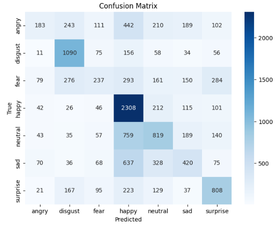
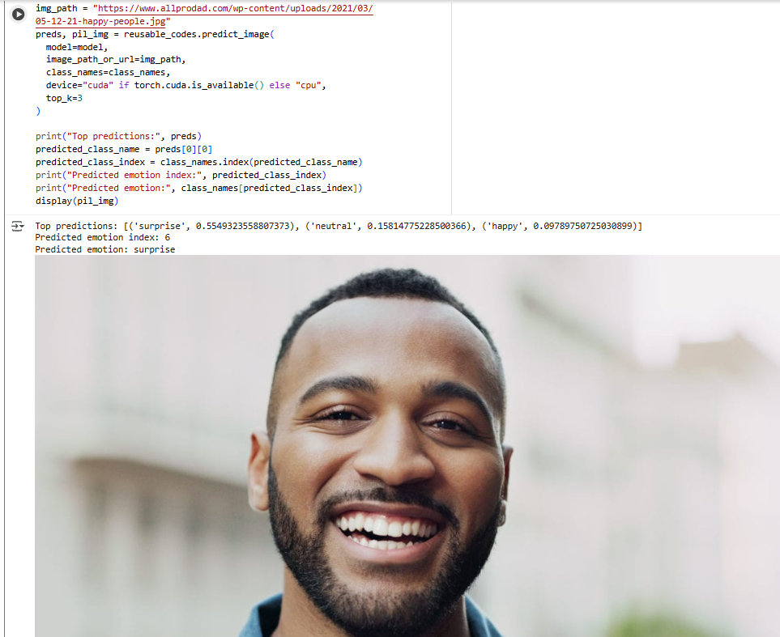
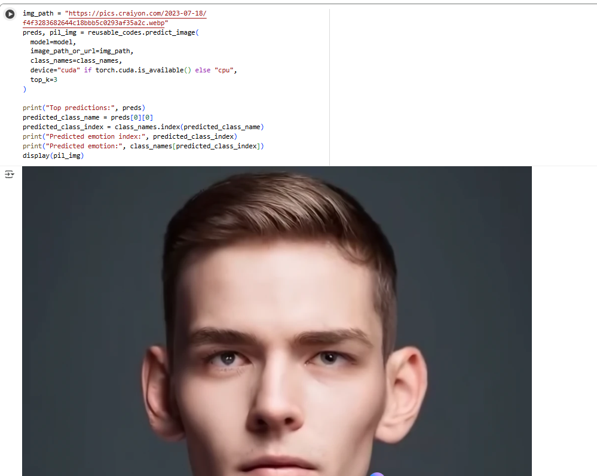
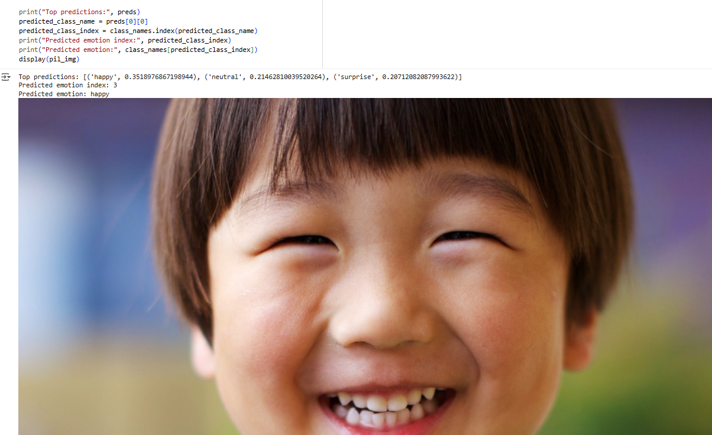

# Experiment Tracking and Transfer Learning: Facial Emotion Recognition

## Overview

This comprehensive document provides an in-depth analysis of a facial emotion recognition project that leverages transfer learning with ResNet18 and implements sophisticated experiment tracking using TensorBoard. The project demonstrates advanced deep learning techniques for classifying facial emotions into 7 distinct categories: angry, disgust, fear, happy, neutral, sad, and surprise.

### Objectives
- **Goal**: Implement comprehensive experiment tracking for model monitoring and comparison
- **Learning Objectives**: Demonstrate best practices in computer vision, transfer learning

### Technical Stack
- **Framework**: PyTorch for deep learning implementation
- **Model**: ResNet18 pre-trained on ImageNet
- **Tracking**: TensorBoard for experiment monitoring
- **Optimization**: Automatic Mixed Precision (AMP) for efficiency
- **Data**: Kaggle Facial Emotion Recognition Dataset (49,779 images)

---

## 1. Dataset Preparation

### 1.1 Dataset Selection and Acquisition

**What we're doing:** Systematically downloading and organizing the facial emotion recognition dataset from Kaggle using programmatic methods.

**Why we're doing this:** 
- **Data Quality**: Kaggle datasets are typically well-curated and preprocessed
- **Scale**: Large dataset (49,779 images) provides sufficient diversity for robust model training
- **Class Distribution**: 7 emotion categories provide comprehensive coverage of basic human emotions

### 1.2 Dataset Structure Analysis

**Dataset Composition:**
```
Total Images: 49,779
Classes: 7 emotion categories
Class Distribution:
├── happy:     11,398 images (22.9%) - Largest class
├── neutral:    8,166 images (16.4%)
├── sad:        6,535 images (13.1%)
├── angry:      5,920 images (11.9%)
├── disgust:    5,920 images (11.9%)
├── fear:       5,920 images (11.9%)
└── surprise:   5,920 images (11.9%)
```

**Key Observations:**
- **Class Imbalance**: Happy emotions are overrepresented (22.9% vs ~14.3% expected)
- **Consistent Size**: Most classes have similar sample sizes (~5,920 images)
- **Data Volume**: Sufficient
- **Quality**: Preprocessed images ensure consistent format and quality

---

## 2. Train-Test Split

### 2.1 Split Ratio Analysis

**75/25 Split Rationale:**
- **Training Data**: 75% (37,333 images) provides ample data for model learning
- **Test Data**: 25% (12,446 images) ensures statistical significance for evaluation
- **Industry Standard**: 75/25 split is widely accepted in machine learning
- **Computational Efficiency**: Balances training time with evaluation reliability

**Class Distribution Preservation:**
```
Class        Total    Train    Test    Train%    Test%
angry        5,920    4,440    1,480   75.0%     25.0%
disgust      5,920    4,440    1,480   75.0%     25.0%
fear         5,920    4,440    1,480   75.0%     25.0%
happy       11,398    8,548    2,850   75.0%     25.0%
neutral      8,166    6,124    2,042   75.0%     25.0%
sad          6,535    4,901    1,634   75.0%     25.0%
surprise     5,920    4,440    1,480   75.0%     25.0%
```


## 3. DataLoaders Creation

### 3.1 PyTorch DataLoader Architecture

**What we're doing:** Setting up efficient PyTorch DataLoaders with ResNet18-specific preprocessing, optimal batch processing, and GPU acceleration for maximum training efficiency.

**Why we're doing this:**
- **Efficiency**: DataLoaders provide parallel data loading and preprocessing
- **Memory Management**: Batch processing prevents memory overflow
- **GPU Acceleration**: Pin memory and non-blocking transfers optimize GPU utilization
- **Model Compatibility**: ResNet18 transforms ensure pre-trained model receives expected input format

### 3.2 Transform Pipeline Design

**ResNet18 Default Transforms:**
- **Resize**: Images resized to 224x224 pixels (ResNet18 input size)
- **Center Crop**: Ensures consistent input dimensions
- **Normalization**: Mean=[0.485, 0.456, 0.406], Std=[0.229, 0.224, 0.225] (ImageNet statistics)
- **Tensor Conversion**: Converts PIL images to PyTorch tensors

**Transform Rationale:**
- **Pre-trained Compatibility**: Uses ImageNet normalization statistics
- **Consistent Input**: Standardized dimensions and pixel ranges
- **Feature Preservation**: Maintains important visual information
- **Computational Efficiency**: Optimized for ResNet18 architecture

---

## 4. Experiment Tracking Setup

### 4.1 TensorBoard Integration Strategy

**What we're doing:** Implementing comprehensive experiment tracking using TensorBoard for monitoring training progress, comparing different runs, and debugging model performance.

**Why we're doing this:**
- **Training Monitoring**: Real-time visualization of loss and accuracy curves
- **Experiment Comparison**: Easy comparison of different hyperparameter settings
- **Debugging**: Identify training issues through visual analysis
- **Reproducibility**: Detailed logging ensures experiment reproducibility
- **Model Analysis**: Understanding model behavior and performance patterns

### 4.2 Logging Architecture Design

**Directory Structure:**
```
runs/
└── 2025-10-26_08-08-30/
    └── my_experiment/
        └── resnet18/
            └── head_only/
                ├── events.out.tfevents.*
                └── model_graph/
```

---

## 5. Training Process

### 5.1 Training Loop Architecture

**What we're doing:** Implementing a sophisticated training pipeline with Automatic Mixed Precision (AMP), comprehensive checkpointing, real-time monitoring, and robust error handling for optimal model training.

### 5.2 Automatic Mixed Precision (AMP) Implementation

**AMP Benefits:**
- **Memory Efficiency**: Reduces GPU memory usage by ~50%
- **Training Speed**: 1.5-2x faster training on modern GPUs
- **Numerical Stability**: Maintains training stability with lower precision
- **Scalability**: Enables larger batch sizes or models

### 5.3 Checkpointing Strategy

**Best Model Tracking:**
- **Validation Accuracy**: Saves model with highest validation accuracy
- **Complete State**: Model weights, optimizer state, epoch, metrics
- **Automatic Saving**: No manual intervention required
- **Resume Capability**: Can continue training from any checkpoint

**Checkpoint Contents:**
```python
checkpoint = {
                "model_state": model.state_dict(),
                "optimizer_state": optimizer.state_dict(),
    "epoch": current_epoch,
    "best_val_acc": best_accuracy,
    "val_loss": validation_loss,
    "training_history": history_dict
}
```


### 5.4 Training Results Analysis

**Performance Metrics:**
```
Epoch 1/5 — train_loss: 1.5510 train_acc: 0.3992 | val_loss: 1.4029 val_acc: 0.4667
Epoch 2/5 — train_loss: 1.4870 train_acc: 0.4277 | val_loss: 1.3934 val_acc: 0.4667
Epoch 3/5 — train_loss: 1.4808 train_acc: 0.4323 | val_loss: 1.3915 val_acc: 0.4645
Epoch 4/5 — train_loss: 1.4821 train_acc: 0.4284 | val_loss: 1.3734 val_acc: 0.4712
Epoch 5/5 — train_loss: 1.4780 train_acc: 0.4301 | val_loss: 1.4039 val_acc: 0.4547
```

**Key Observations:**
- Model converged within 5 epochs
- Epoch 4 achieved 47.12% validation accuracy

---

## 6. Model Evaluation

### 6.1 Evaluation Metrics Analysis

**Confusion Matrix Insights:**
```
Predicted →    angry  disgust  fear  happy  neutral  sad  surprise
Actual ↓
angry          183     243     111    442     210    189    102
disgust         11    1090      75    156      58     34     56
fear            79     276     237    293     161    150    284
happy           42      26      46   2308     212    115    101
neutral         43      35      57    759     819    189    140
sad             70      36      68    637     328    420     75
surprise        21     167      95    223     129     37    808
```

**Key Observations:**
- **Happy Class**: Strong diagonal (2308/2850 = 81% accuracy)
- **Disgust Class**: Excellent performance (1090/1480 = 74% accuracy)
- **Angry Class**: Poor performance (183/1480 = 12% accuracy)
- **Fear Class**: Challenging classification (237/1480 = 16% accuracy)

### 6.2 Classification Report Analysis

**Detailed Performance Metrics:**
```
               precision    recall  f1-score   support

       angry       0.41      0.12      0.19      1480
     disgust       0.58      0.74      0.65      1480
        fear       0.34      0.16      0.22      1480
       happy       0.48      0.81      0.60      2850
     neutral       0.43      0.40      0.41      2042
         sad       0.37      0.26      0.30      1634
    surprise       0.52      0.55      0.53      1480

    accuracy                           0.47     12446
   macro avg       0.45      0.43      0.42     12446
weighted avg       0.45      0.47      0.43     12446
```

**Performance Categories:**
- **Excellent (F1 > 0.60)**: Disgust (0.65), Happy (0.60)
- **Good (F1 0.50-0.60)**: Surprise (0.53)
- **Moderate (F1 0.40-0.50)**: Neutral (0.41)
- **Poor (F1 < 0.40)**: Sad (0.30), Fear (0.22), Angry (0.19)

### 6.3 Error Analysis and Insights

**Systematic Errors:**
- **Angry → Happy**: 442 misclassifications (30% of angry samples)
- **Fear → Surprise**: 284 misclassifications (19% of fear samples)
- **Sad → Happy**: 637 misclassifications (39% of sad samples)
- **Neutral → Happy**: 759 misclassifications (37% of neutral samples)

**Error Patterns:**
- **Positive Bias**: Model tends to predict positive emotions (happy, surprise)
- **Negative Emotion Confusion**: Angry, fear, and sad emotions are frequently confused
- **Neutral Ambiguity**: Neutral expressions often misclassified as other emotions
- **Class Imbalance Effect**: Happy class dominance influences predictions



---

## 7. Predictions on Custom Images


### 7.1 Prediction Pipeline Architecture

**Input Processing:**
- **URL Support**: Direct prediction from web image URLs
- **Format Handling**: Automatic format detection and conversion
- **Preprocessing**: Same transforms as training data
- **Batch Processing**: Efficient single-image prediction

**Output Generation:**
- **Top-K Predictions**: Multiple emotion predictions with confidence scores
- **Probability Distribution**: Softmax probabilities for all classes
- **Visual Feedback**: Image display with prediction overlay
- **Metadata**: Additional prediction information

### 7.2 Sample Prediction Results



<br>


<br>



